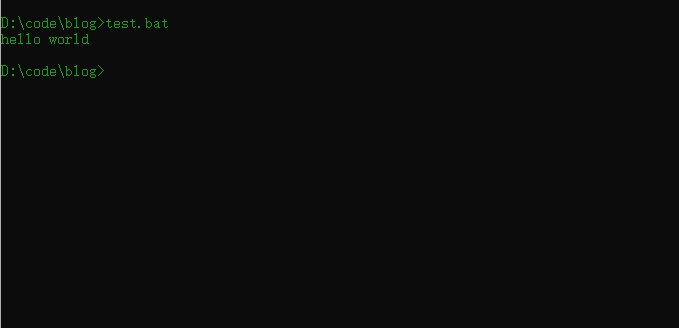

# for 循环

``` batch
for %%i in (./*) do (echo hello world)
````

# if 判断条件

``` batch
if str == "test" (
    条件体1
)else(
    条件体2
)
```

# 设置变量

## echo
``` batch
@echo off
```
关闭echo显示
``` batch
@echo off
echo hello world
```

``` batch
@echo on
echo hello world
```


## setlocal enabledelayedexpansion
set：设置 local：本地（环境变量） enable：能够 delayed：延迟 expansion：扩展
批处理读取命令时是按行读取的（另外例如for命令等，其后用一对圆括号闭合的所有语句也当作一行），在处理之前要完成必要的预处理工作，这其中就包括对该行命令中的变量赋值。所以下例中,输出为4
``` batch
set a=4
set a=5 & echo %a%
```
设置setlocal enabledelayedexpansion且将变量使用!!括起来后,输出5
``` batch
set a=4
set a=5 & echo !a!
```

