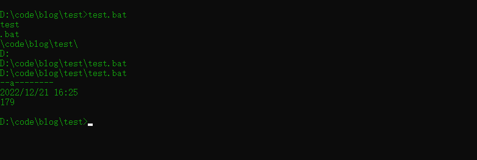

# for 循环

``` batch
for %%i in (./*) do (echo hello world)
````

# if 判断条件

``` batch
if str == "test" (
    条件体1
)else(
    条件体2
)
```

# 设置变量

## echo
``` batch
@echo off
```
关闭echo显示
``` batch
@echo off
echo hello world
```

``` batch
@echo on
echo hello world
```


## setlocal enabledelayedexpansion
set：设置 local：本地（环境变量） enable：能够 delayed：延迟 expansion：扩展
批处理读取命令时是按行读取的（另外例如for命令等，其后用一对圆括号闭合的所有语句也当作一行），在处理之前要完成必要的预处理工作，这其中就包括对该行命令中的变量赋值。所以下例中,输出为4
``` batch
set a=4
set a=5 & echo %a%
```
设置setlocal enabledelayedexpansion且将变量使用!!括起来后,输出5
``` batch
set a=4
set a=5 & echo !a!
```
## 字符串及路径处理
n:name,文件名
x:extension,拓展名
p:path,文件路径
d:driver,文件所在盘符
f:full name,文件所在完整的路径
s:short name,文件短名
a:attribute,文件属性
t:time,文件时间
z:size,文件大小
``` batch
@echo off
for %%i in (./*) do (
    echo %%~ni
    echo %%~xi
    echo %%~pi
    echo %%~di
    echo %%~fi
    echo %%~si
    echo %%~ai
    echo %%~ti
    echo %%~zi
)
```
效果如下

假设路径变量为%%L,比如
``` batch
for %%L in (./*) do echo(
    example
)
```


